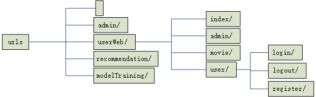

# !caution! #

本项目仅限学习交流使用，希望大家积极贡献代码，我接受经过测试的代码，提交时记得附上test.py

偷我代码的我诅咒你生孩子没屁眼，吃方便面没叉子。

# 简介
基于协同过滤的电影推荐网站的django重构项目

原项目地址：
[MovieRecommendSystem](https://github.com/jagger235711/MovieRecommendSystem.git)

参考项目：[Team-Website](https://github.com/kqhasaki/Team-Website.git)

# 项目设计

## 网站概要设计

### 实体类分析
属性不全，数据主要来自Team-Website
1. 用户实体

2. 电影实体

### 用例分析
1. 用户用例图

### 系统功能结构设计

### 路由系统设计

